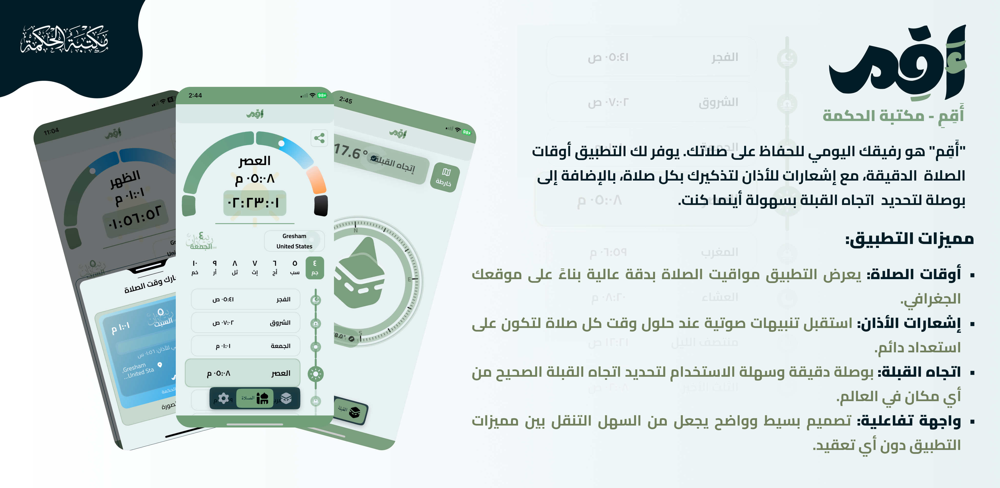

<p align="center">
	
</p>

# أَقِم — Aqim

تطبيق مواقيت الصلاة والقبلة البسيط والدقيق. Flutter app for Prayer Times and Qibla.

—

## المحتويات · Table of Contents

- [العربية](#العربية)
	- [نبذة](#نبذة)
	- [المميزات](#المميزات)
	- [الأذونات والخصوصية](#الأذونات-والخصوصية)
	- [التثبيت والتشغيل](#التثبيت-والتشغيل)
- [English](#english)
	- [Overview](#overview)
	- [Features](#features)
	- [Permissions & Privacy](#permissions--privacy)
	- [Build & Run](#build--run)

<p align="center">
	
</p>

---

## العربية

### نبذة

تطبيق "أَقِم" هو تطبيق إسلامي بسيط ومباشر، مصمم خصيصًا لمساعدتك على أداء صلاتك في وقتها وبكل سهولة. يركز التطبيق على تقديم الأدوات الأساسية التي يحتاجها كل مسلم في حياته اليومية، من خلال واجهة تفاعلية سهلة الاستخدام تضمن لك تجربة مريحة وواضحة. مع "أَقِم"، لن تفوتك أي صلاة بعد الآن؛ إذ يعمل التطبيق كمُنبه شخصي وموجّه دقيق لقبلتك، مما يجعله الأداة المثالية للحفاظ على أهم أركان الإسلام.

### المميزات

- أوقات الصلاة: يعرض التطبيق مواقيت الصلاة بدقة عالية بناءً على موقعك الجغرافي.
- إشعارات الأذان: استقبل تنبيهات صوتية عند حلول وقت كل صلاة لتكون على استعداد دائم.
- اتجاه القبلة: بوصلة دقيقة وسهلة الاستخدام لتحديد اتجاه القبلة الصحيح من أي مكان في العالم.
- واجهة تفاعلية: تصميم بسيط وواضح يجعل من السهل التنقل بين مميزات التطبيق دون أي تعقيد.

### الأذونات والخصوصية

- الموقع: لاستخدام الحسابات الدقيقة لمواقيت الصلاة وتحديد اتجاه القبلة.
- الإشعارات: لإرسال التنبيهات عند دخول وقت الصلاة.

نلتزم باحترام خصوصيتك وعدم جمع أي بيانات شخصية غير ضرورية.

### التثبيت والتشغيل

متطلبات أساسية:

- Flutter SDK 3.22+ (أو الأحدث)
- Xcode/Android Studio وأدوات المنصات ذات الصلة

خطوات سريعة:

1) تثبيت الحزم:

```bash
flutter pub get
```

2) تشغيل التطبيق على جهاز/محاكي متصل:

```bash
flutter run
```

3) إنشاء نسخة إنتاجية (اختياري):

```bash
# Android
flutter build apk --release

# iOS (يتطلب macOS وXcode)
flutter build ipa --release
```

> يدعم التطبيق تعدد اللغات عبر ملفات `assets/locales/*.json`.

---

## English

### Overview

“Aqim” is a simple and focused Islamic app built to help you pray on time with ease. It provides the essential daily tools for every Muslim with a clean, interactive UI for a clear and comfortable experience. With Aqim, you won’t miss a prayer again—think of it as your personal reminder with accurate Qibla guidance.

### Features

- Prayer Times: Highly accurate timings based on your geographic location.
- Adhan Notifications: Receive audible alerts when it’s time to pray.
- Qibla Direction: A precise and easy-to-use compass to find the Qibla anywhere.
- Interactive UI: A clean, straightforward design that’s effortless to navigate.

### Permissions & Privacy

- Location: Required for accurate prayer times and Qibla direction.
- Notifications: To alert you at prayer times.

We respect your privacy and do not collect unnecessary personal data.

### Build & Run

Prerequisites:

- Flutter SDK 3.22+ (or newer)
- Xcode/Android Studio with platform toolchains

Quick start:

1) Install dependencies:

```bash
flutter pub get
```

2) Run on a connected device/emulator:

```bash
flutter run
```

3) Build release (optional):

```bash
# Android
flutter build apk --release

# iOS (requires macOS & Xcode)
flutter build ipa --release
```

—

Made with Flutter. If you have suggestions or find issues, please open an issue or a pull request.
